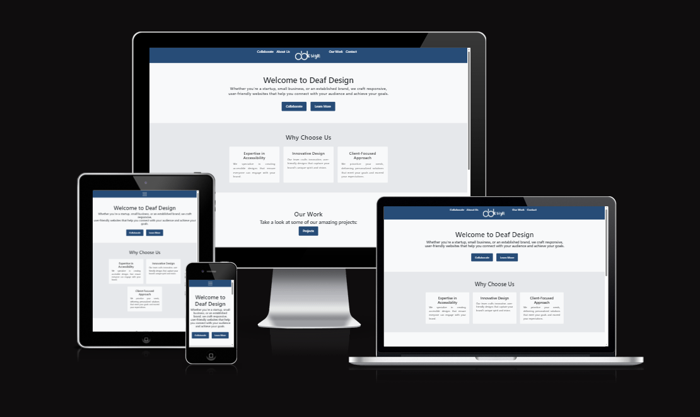

# Deaf Design
https://ui.dev/amiresponsive?url=https://ddesign-pp5-01f27d10398c.herokuapp.com/
## Introduction
Deaf Design is a web design company: Founded and operated by Deaf professionals, dedicated to creating visually stunning and accessible websites that bridge the gap between the Deaf & people and hearing communities. Our team of talented Deaf designers brings a unique perspective to the digital landscape, leveraging their heightened visual acuity and innate understanding of visual communication to craft websites that are not only aesthetically pleasing but also intuitively navigable. 

The goal was to have a website on basis that I hopefully will become a web dev.

 
source: [amiresponsive](https://ui.dev/amiresponsive)

## UX
When decide on the Project 5 - I was thinking about how to do ecommerce that is not the same as boutique ado, want to see if I can do it slightly different so went webdesign business. 

### Structure
The idea is Web Design by Deaf Professionals
Making it accessible ecommerce solutions that demonstrate disability is no barrier to technical excellence, crafting visually immersive websites that empower businesses while bridging communication divides.

Website Design Goals
- Let people/business know that disability is not a barrier, when are coding we don't need use ears.
- Design website
- Key Message

Website Essentials
1. Portfolio Showcase
(Demonstrate Technical Mastery & Accessibility)
2. Stripe Payment Integration
(Seamless Transaction Experience)
3. Simplified Contact Flow
(Barrier-Free Communication)
4. Newsletter Ecosystem
(Dual-Channel Engagement)

### Colour Scheme 
I have chose the color blue as the main colour
The colour Blue is so significant to Deaf people, Deaf community and also is the colour of the Irish Deaf Society
Dark blue was chosen by the World Federation of the Deaf and Deaf associations around the World to represent Deafhood.
I used [coolors.co](https://coolors.co/274c77-1a3a5f-e6e8eb-ffffff-f8f9fa) to generate my colour palette.


| Colour | Use for | 
| --- | --- | 
| #274C77 | Main Colour - Buttons and  Header |
| #1A3A5F | When the cursor move over to the buttons |
| #E6E8EB | Background colour in the body section(container) |
| #F8F9FA| Background colour in the body section(container) |
| #FFFFFF | Font in the button and header |
| #000 | Main Font in the body and footer section  |

| Coolor Text and background | Coolor Text and background | 
| --- | --- | 
|  |  | 
|  |  |
|  |  |  


## User Stories

### New Site Users

- As a new site user, I would like to be able to navigate the page, so that I can see what the website is about.
- As a new site user, I would like to be able to sign up the newsletter subscription.
- As a new site user, I would like to be able to able to send an email on the contact page
- As a new site user, I would like to be able to purchase the collaboration.
- As a new site user, I would like to be able to see what kind of works they do and does it works

### Returning Site Users
- As a returning site user, I would like to see the updates that they created a website.

### Site Admin

- As a site administrator, I should be able to log into the admin page.
- As a site administrator, I should be able to update the works section.
- As a site administrator, I should be able to use CRUD on the FAQ section in about page.
- As a site administrator, I should be able to manage the contact us, so that I can received message.

## Wireframes
- As I design the wireframe from the start, It slightly change over time as decided to keep it simple and get the code working.

### Desktop Wireframes
| Home| Collaboration | About | 
| --- | --- | --- | 
|  |   |  |

| work| contact | Payment |
| --- | --- | --- | 
|  |   |  |


### Mobile Wireframes
| Home| Collaboration | About | 
| --- | --- | --- | 
|  |   |  |

| work| contact | Payment |
| --- | --- | --- | 
|  |   |  |


### Existing Features
- **Home**

    - This is the first page when the website is loaded, present the user with options to chose from in the navbar.
    1) Collaborate - Working together
    2) Our Work - Website that Deaf Design have created
    3) About - What the website is all about. In the FAQ section, the staff can edit the faq but when the user login they cannot.
    4) Contact - for user to get in touch with the admin
    5) Logo - back to the home page
    6) Section divided as scroll down with two different colour

| Home| 
| --- | 
|  |

- **About**

    - About page, this is learning how Deaf Design came about and history & mission, when you scroll down it has FAQ.

| About | Faq  |
| --- | --- |
|  |  

- **Contact**

    - Contact page, this is when a user want to get in touch with the admin. The user must type in Name, Email Address and Message to be able to submit a message 
    
| Contact | Thank you message |  
| --- | --- | 
|  |  |

- **Our Work**

    - Work page, this is where Deaf Design has created a website for other companies, It has categories and click on different website page that will bring you to other website.
    
| Work | Charity | retail | service | 
| --- | --- |  --- | --- | 
|  |  |  |  |

- **Collaborate**

    - Collaborate page, this is where and how the process work if the user wants to work with Deaf Design also has a payment form that brings to checkout
    
| Collaborate |   
| --- |
|  |

- **Payment**

    - Payment page / Check out page, It has credit details and form for user to log in the deatails to make payment.
    
|Payment | Payment completed|  
| --- | --- | 
|  |  |

- **Others**
    
|Subscribe | Policy Page | Django Admin | 404page |
| --- | --- | --- | --- |
| This is at the bottom of the page, where user can subscribe to newsletter | Policy Page is external page that goes to termsfeed | admin page for the Owner to update and check | a page that doesnt exist, can be a typo |
|  |  |  |  |

- **Register**

    - Register page, this is where a person sign up to become a user or staff. A person must enter email, username and password which needs to be twice. No username can be the same.
    
|Register | Register Issue |  
| --- | --- | 
|  |  |

- **Log In**

    - Log in page, this page is when a user log in, the user must type in username and password to be able to log in.e.
    
| Start | End |  
| --- | --- | 
|  |  |

- **Staff Editing FAQ**

    - Staff editing FAQ on the about page in the FAQ section, either click delete or edit, when click edit goes to edit section where update faq.
    
|FAQ About Section | Manage FAQ question and answer |  
| --- | --- | 
|  |  |

### Future Features
- People/User to upload video on the contact us page so people can sign in their own sign language.
- In work page each section to have full width of mockup on each device i.e. laptop, tablet of companies we work with.
- Will have a blog page so that users can read the blog and make comments
  
## Tools & Technologies Used
- [](https://git-scm.com) used for version control. (`git add`, `git commit`, `git push`)
- [](https://github.com) used for secure online code storage.
- [](https://gitpod.io) used as a cloud-based IDE for development.
- [](https://en.wikipedia.org/wiki/HTML) used for the main site content.
- [](https://en.wikipedia.org/wiki/CSS) used for the main site design and layout.
- [](https://www.javascript.com) used for user interaction on the site.
- [](https://www.python.org) used as the back-end programming language.
- [](https://www.heroku.com) used for hosting the deployed back-end site.
- [](https://getbootstrap.com) used as the front-end CSS framework for modern responsiveness and pre-built components.
- [](https://www.djangoproject.com) used as the Python framework for the site.
- [](https://stripe.com/ie) used for online secure payments of ecommerce products/services.
- [](https://www.postgresql.org) used as the relational database management.
- [](https://cloudinary.com) used for online static file storage.
- [](https://whitenoise.readthedocs.io) used for serving static files with Heroku.
- [](https://balsamiq.com/wireframes) used for creating wireframes.
- [](https://www.canva.com/p/canvawireframes) used for creating images & erd
- [](https://fontawesome.com) used for the icons.
- [](https://replit.com/) used for seeing how the layout will look like before designing the website.
- [](https://chat.openai.com) used to help debug, troubleshoot, and explain things.
- [](https://www.perplexity.ai/) used to help debug, troubleshoot, and explain things.
- [](https://copilot.microsoft.com/) used to help debug, troubleshoot, and explain things.

## Database Design
Entity Relationship Diagrams (ERD) help to visualise database architecture before creating models.
I have used pygraphviz and django-extensions to auto-generate an ERD.

Contact
```
class ContactForm(models.Model):
    name = models.CharField(max_length=200, blank=False)
    phonenumber = models.CharField(max_length=15, blank=True)
    email = models.EmailField(blank=False)
    message = models.TextField(blank=False)
    created_at = models.DateTimeField(auto_now_add=True)
```
FAQ
```
class FAQ(models.Model):
    question = models.CharField(max_length=255)
    answer = models.TextField()
```
Checkout
```
class Order(models.Model):

    STATUS_CHOICES = [
      ('pending', 'Pending'),
      ('completed', 'Completed'),
    ]

    full_name = models.CharField(max_length=50, null=False, blank=False)
    email = models.EmailField(max_length=254, null=False, blank=False)
    phone_number = models.CharField(max_length=20, null=False, blank=False)
    country = models.CharField(max_length=40, null=False, blank=False)
    town_or_city = models.CharField(max_length=40, null=False, blank=False)
    street_address1 = models.CharField(max_length=80, null=False, blank=False)
    street_address2 = models.CharField(max_length=80, null=True, blank=True)
    postal_code = models.CharField(max_length=20, null=False, blank=False)
    date = models.DateTimeField(auto_now_add=True)
    item_name = models.CharField(max_length=100, null=False, blank=False)
    item_price = models.DecimalField(max_digits=10, decimal_places=2,
                                     null=False)
    grand_total = models.DecimalField(max_digits=10, decimal_places=2,
                                      null=False, default=0)
```
Newsletter
```
class NewsletterSubscriber(models.Model):
    email = models.EmailField(unique=True)
    date_subscribed = models.DateTimeField(auto_now_add=True)
```
Work
```
class Category(models.Model):
    name = models.CharField(max_length=50)
```
```
class Website(models.Model):
    CATEGORY_CHOICES = [
        ('charity', 'Charity'),
        ('retail', 'Retail'),
        ('service', 'Service'),
    ]

    name = models.CharField(max_length=100)
    description = models.TextField()
    url = models.URLField()
    category = models.CharField(max_length=20, choices=CATEGORY_CHOICES)
```
The steps taken were as follows:

- In the terminal: sudo apt update
- then: sudo apt-get install python3-dev graphviz libgraphviz-dev pkg-config
- then type Y to proceed
- then: pip3 install django-extensions pygraphviz
- in my settings.py file, I added the following to my INSTALLED_APPS
 ``` 
   'django_extensions'
 ```
- back in the terminal: python3 manage.py graph_models -a -o erd.png
- dragged the new erd.png file into my documentation/ folder
- removed 'django_extensions', from my INSTALLED_APPS
- finally, in the terminal: pip3 uninstall django-extensions pygraphviz -y

 

## Agile Development Process
Used Agile plan to manage the project, it wasn't straightforward as expected.

### GitHub Projects
[GitHub Projects](https://github.com/AlanSmythDeaf/deafweb/projects?query=is%3Aopen) served as an Agile tool for this project.
It isn't a specialized tool, but with the right tags and project creation/issue assignments, it can be made to work.
Through it, user stories, issues, and milestone tasks were planned, then tracked on a weekly basis using the basic Kanban board.
screenshot Projects Board.

### GitHub Issues
[GitHub Issues](https://github.com/AlanSmythDeaf/deafweb/issues) served as an another Agile tool.
There, I used my own **User Story Template** to manage user stories.
It also helped with milestone iterations on a weekly basis.

### MoSCOw
It's a method that prioritzation technique used in management, The acronym MoSCoW represents four categories of initiatives: must-have, should-have, could-have, and won't-have, or will not have right now. I use Must-have and should-have for planning the website. The most important is using should which I should use.

### Ecommerce Business Model
Deaf Design operates as a B2B web design agency led by Deaf professionals, specializing in visually striking, accessibility-first websites that foster seamless interaction between Deaf and hearing communities. This model emphasizes strategic efficiency through structured consultation fees, prioritizing project planning, collaborative reviews, and iterative design sprints to eliminate inefficiencies and ensure precision in execution.

Social media integration serves as a cornerstone for growth, leveraging platforms like LinkedIn, Instagram, and YouTube to amplify reach, showcase portfolio work, and engage corporate clients. Content strategies—such as behind-the-scenes design processes, accessibility case studies, and client testimonials—will boost site traffic while positioning the agency as an industry thought leader.

The newsletter will function as a dual-purpose tool:
- Client updates: Highlight recent projects, accessibility breakthroughs, and partnership opportunities
- Community engagement: Share industry news, Deaf community initiatives, and resources for inclusive design
- This approach nurtures long-term client relationships while building a support network for accessibility advocates.

### Search Engine Optimization (SEO) & Social Media Marketing
### Keywords
I've identified some appropriate keywords to align with my site, which should help users find my page easily from a search engine when searching online. This included a series of the following keyword types

Short-tail (head terms) keywords
Long-tail keywords
I also played around with [Word Tracker](https://www.wordtracker.com/) a bit to check the frequency of some of my site's primary keywords (only until the free trial expired).

### Sitemap
I've used XML-Sitemaps to generate a sitemap.xml file. This was generated using my deployed site URL: https://signcoding-d529cc1ebf99.herokuapp.com
After crawling the entire site, it created a sitemap.xml(sitemap.xml), which I've downloaded and included in the repository.

### Robots
```

User-agent: *
Disallow:  
Sitemap: https://ddesign-pp5-01f27d10398c.herokuapp.com/sitemap.xml

```
Further links for future implementation:

- [Google search console](https://search.google.com/search-console/welcome)
- [Creating and submitting a sitemap](https://developers.google.com/search/docs/crawling-indexing/sitemaps/build-sitemap)
- [Managing your sitemaps and using sitemaps reports](https://support.google.com/webmasters/answer/7451001)
- [Testing the robots.txt file](https://support.google.com/webmasters/answer/6062598)
  
## Social Media
### Facebook
Create a MockUp Facebook
Having a social media presence is essential for e-commerce businesses because it significantly expands their reach and enhances customer engagement beyond what a standalone website can achieve. Social media platforms like Facebook, Instagram, and TikTok boast billions of active users. Unlike websites, which rely on users actively seeking them out, social media allows businesses to meet potential customers where they already spend their time, increasing visibility and brand recognition.
I've set up a Facebook business account to establish a presence for my e-commerce brand. This account will serve as a platform to connect with potential customers, showcase products, share updates, and build engagement.
|Facebook Page | Facebook Post |  
| --- | --- | 
|  |  |
### Newsletter
To recieved the newsletter, the user will need to subscribe to the newsletter by entering an email adress. This is located at the bottom of the page. At first I used Django and then change it to using the MailChimp newsletter
|Subscribe | When the user enter email address |  
| --- | --- | 
|  |  |

## Testing
> [!NOTE]  
> For all testing, please refer to the [TESTING.md](TESTING.MD) file.

## Deployment

The live deployed application can be found deployed on [Heroku](https://ddesign-pp5-01f27d10398c.herokuapp.com/).

### PostgreSQL Database

This project uses a [Code Institute PostgreSQL Database](https://dbs.ci-dbs.net).

To obtain my own Postgres Database from Code Institute, I followed these steps:

- Signed-in to the CI LMS using my email address.
- An email was sent to me with my new Postgres Database.

> [!CAUTION]  
> - PostgreSQL databases by Code Institute are only available to CI Students.
> - You must acquire your own PostgreSQL database through some other method
> if you plan to clone/fork this repository.
> - Code Institute students are allowed a maximum of 8 databases.
> - Databases are subject to deletion after 18 months.

### Stripe
This project uses Stripe to handle the ecommerce payments.

Once you've created a Stripe account and logged-in, follow these series of steps to get your project connected.

- From your Stripe dashboard, click to expand the "Get your test API keys".
- You'll have two keys here:
  - STRIPE_PUBLIC_KEY = Publishable Key (starts with pk)
  - STRIPE_SECRET_KEY = Secret Key (starts with sk)

### Gmail
This project uses Gmail to handle sending emails to users for account verification and purchase order confirmations.

Once you've created a Gmail (Google) account and logged-in, follow these series of steps to get your project connected.

- Click on the Account Settings (cog icon) in the top-right corner of Gmail.
- Click on the Accounts and Import tab.
- Within the section called "Change account settings", click on the link for Other Google Account settings.
- From this new page, select Security on the left.
- Select 2-Step Verification to turn it on. (verify your password and account)
- Once verified, select Turn On for 2FA.
- Navigate back to the Security page, and you'll see a new option called App passwords.
- This might prompt you once again to confirm your password and account.
- Select Mail for the app type.
- Select Other (Custom name) for the device type.
  - Any custom name, such as "Django" or KicksOnFire
- You'll be provided with a 16-character password (API key).
  - Save this somewhere locally, as you cannot access this key again later!
  - EMAIL_HOST_PASS = user's 16-character API key
  - EMAIL_HOST_USER = user's own personal Gmail email address

### Heroku Deployment

This project uses [Heroku](https://www.heroku.com), a platform as a service (PaaS) that enables developers to build, run, and operate applications entirely in the cloud.

Deployment steps are as follows, after account setup:

- Select **New** in the top-right corner of your Heroku Dashboard, and select **Create new app** from the dropdown menu.
- Your app name must be unique, and then choose a region closest to you (EU or USA), and finally, select **Create App**.
- From the new app **Settings**, click **Reveal Config Vars**, and set your environment variables.

> [!IMPORTANT]  
> This is a sample only; you would replace the values with your own if cloning/forking my repository.

| Key | Value |
| --- | --- |
| `DATABASE_URL` | user's own value |
| `DISABLE_COLLECTSTATIC` | 1 (*this is temporary, and can be removed for the final deployment*) |
| `EMAIL_HOST_PASS` | user's own value |
| `EMAIL_HOST_USER` | user's own value |
| `SECRET_KEY` | user's own value |
| `STRIPE_PUBLIC_KEY` | user's own value |
| `STRIPE_SECRET_KEY` | user's own value |

Heroku needs three additional files in order to deploy properly.

- requirements.txt
- Procfile
- runtime.txt

You can install this project's **requirements** (where applicable) using:

- `pip3 install -r requirements.txt`

If you have your own packages that have been installed, then the requirements file needs updated using:

- `pip3 freeze --local > requirements.txt`

The **Procfile** can be created with the following command:

- `echo web: gunicorn app_name.wsgi > Procfile`
- *replace **app_name** with the name of your primary Django app name; the folder where settings.py is located*

The **runtime.txt** file needs to know which Python version you're using:
1. type: `python3 --version` in the terminal.
2. in the **runtime.txt** file, add your Python version:
	- `python-3.9.19`

For Heroku deployment, follow these steps to connect your own GitHub repository to the newly created app:

Either:

- Select **Automatic Deployment** from the Heroku app.

Or:

- In the Terminal/CLI, connect to Heroku using this command: `heroku login -i`
- Set the remote for Heroku: `heroku git:remote -a app_name` (replace *app_name* with your app name)
- After performing the standard Git `add`, `commit`, and `push` to GitHub, you can now type:
	- `git push heroku main`

The project should now be connected and deployed to Heroku!

### Local Deployment

This project can be cloned or forked in order to make a local copy on your own system.

For either method, you will need to install any applicable packages found within the *requirements.txt* file.

- `pip3 install -r requirements.txt`.

You will need to create a new file called `env.py` at the root-level,
and include the same environment variables listed above from the Heroku deployment steps.

> [!IMPORTANT]  
> This is a sample only; you would replace the values with your own if cloning/forking my repository.

Sample `env.py` file:

```python
import os

os.environ.setdefault("DATABASE_URL", "user's own value")
os.environ.setdefault("SECRET_KEY", "user's own value")
os.environ.setdefault("EMAIL_HOST_PASS", "user's own value")
os.environ.setdefault("EMAIL_HOST_USER", "user's own value")
os.environ.setdefault("SECRET_KEY", "user's own value")
os.environ.setdefault("STRIPE_PUBLIC_KEY", "user's own value")
os.environ.setdefault("STRIPE_SECRET_KEY", "user's own value")

# local environment only (do not include these in production/deployment!)
os.environ.setdefault("DEBUG", "True")
```

Once the project is cloned or forked, in order to run it locally, you'll need to follow these steps:

- Start the Django app: `python3 manage.py runserver`
- Stop the app once it's loaded: `CTRL+C` or `⌘+C` (Mac)
- Make any necessary migrations: `python3 manage.py makemigrations`
- Migrate the data to the database: `python3 manage.py migrate`
- Create a superuser: `python3 manage.py createsuperuser`
- Load fixtures (if applicable): `python3 manage.py loaddata file-name.json` (repeat for each file)
- Everything should be ready now, so run the Django app again: `python3 manage.py runserver`

#### Cloning

You can clone the repository by following these steps:

1. Go to the [GitHub repository](https://github.com/AlanSmythDeaf/deafweb) 
2. Locate the Code button above the list of files and click it 
3. Select if you prefer to clone using HTTPS, SSH, or GitHub CLI and click the copy button to copy the URL to your clipboard
4. Open Git Bash or Terminal
5. Change the current working directory to the one where you want the cloned directory
6. In your IDE Terminal, type the following command to clone my repository:
	- `git clone https://github.com/AlanSmythDeaf/deafchat.git`
7. Press Enter to create your local clone.

Alternatively, if using Gitpod, you can click below to create your own workspace using this repository.

[](https://gitpod.io/#https://github.com/AlanSmythDeaf/deafchat)

Please note that in order to directly open the project in Gitpod, you need to have the browser extension installed.
A tutorial on how to do that can be found [here](https://www.gitpod.io/docs/configure/user-settings/browser-extension).

#### Forking

By forking the GitHub Repository, we make a copy of the original repository on our GitHub account to view and/or make changes without affecting the original owner's repository.
You can fork this repository by using the following steps:

1. Log in to GitHub and locate the [GitHub Repository](https://github.com/AlanSmythDeaf/deafweb)
2. At the top of the Repository (not top of page) just above the "Settings" Button on the menu, locate the "Fork" Button.
3. Once clicked, you should now have a copy of the original repository in your own GitHub account!

### Local VS Deployment

There was no difference between local and deployment noticed

## Credits

### Content

| Source | Notes |
| --- | --- |
| [Markdown Builder](https://tim.2bn.dev/markdown-builder) | tool to help with readme |
| [W3Schools](https://www.w3schools.com/) | scroll indicator when reading post |
| [Code Insititute](https://codeinstitute.net/ie/) | Using curriculum to learn build the DeafChat  |
| [Code Insititute Slack](https://codeinstitute.net/ie/) | Helping out with issue that I had i.e. amiresponsive  |
| [Canva](https://www.canva.com/) | Using to create a hero image and post image |
| [StackOver Flow](https://stackoverflow.com/) | Java script Issue |
| [DjangoProject](https://www.djangoproject.com/) | Trying to get better understanding |
| [chatgpt](https://openai.com/chatgpt/) | when the terminal display issue, I ask to double check what it means |
| [Accesible Web](https://accessibleweb.com/color-contrast-checker/) | Check to make sure it's ok |
| [Git Commit](https://www.freecodecamp.org/news/how-to-write-better-git-commit-messages/) |Learning how to write git commit |


### Media

| Source | Location | Type | Notes |
| --- | --- | --- | --- |
| [Canva](https://www.canva.com) | entire site | image | logo |


### Acknowledgements

- I would like to thank my Code Institute mentor, [Tim Nelson](https://github.com/TravelTimN) for his support throughout the development of this project.
- I would like to thank everyone at the [Code Institute](https://codeinstitute.net) for the weekly meet up for guidance, advice and support.
- I would like to thank the [Code Institute Slack community](https://code-institute-room.slack.com)
- I would also like to thanks the Deaf people in the slack community

