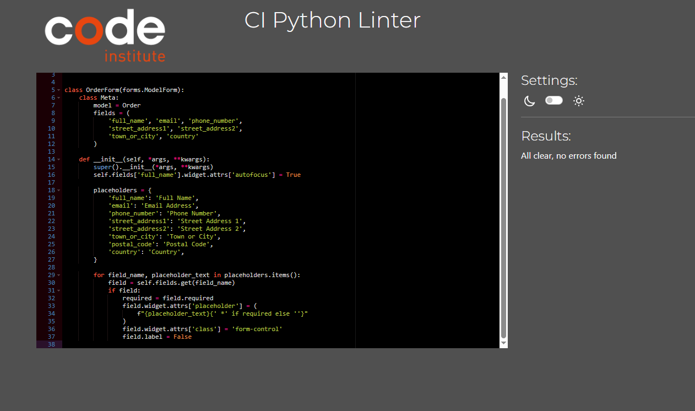
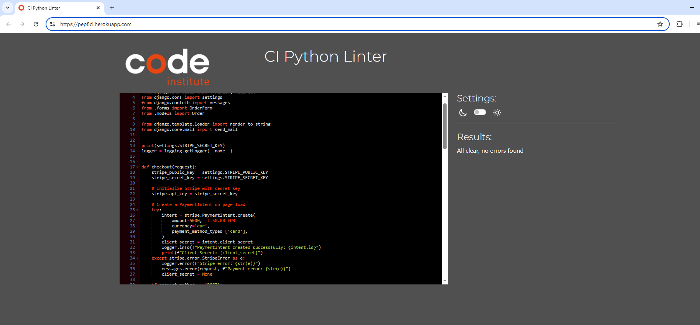
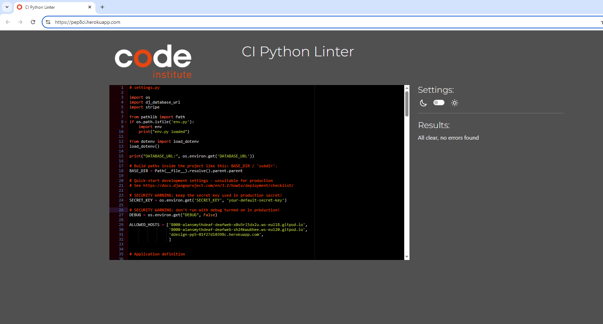
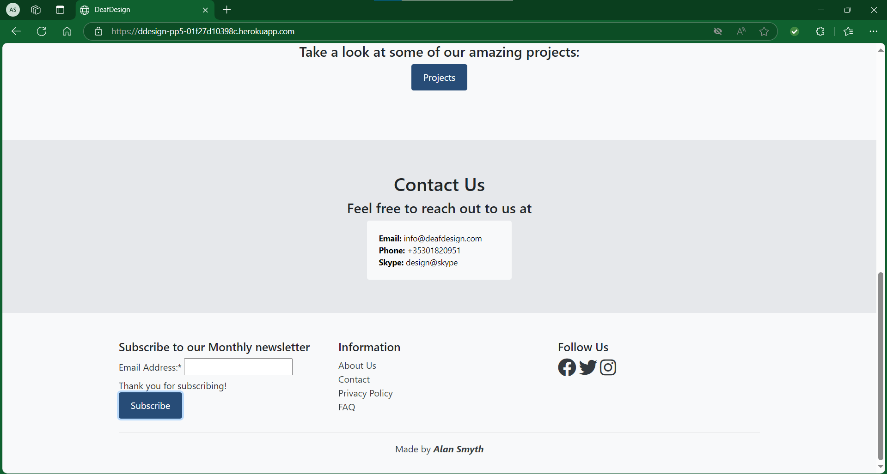

# Testing

> [!NOTE]  
> Return back to the [README.md](README.md) file.

## Code Validation

### HTML

I have used the recommended [HTML W3C Validator](https://validator.w3.org) to validate all of my HTML files.

| Directory | File | Screenshot | Notes |
| --- | --- | --- | --- |
| Home | index.html |  | The type attribute is unnecesary for JavaScript resources (MailChimp) |
| Collaboration | collaboration.html |  | The type attribute is unnecesary for JavaScript resources (MailChimp) |
| About | about.html |  | The type attribute is unnecesary for JavaScript resources (MailChimp) |
| Our Work | workt.html |  |The type attribute is unnecesary for JavaScript resources (MailChimp)|
| Contact | contact.html |  | The type attribute is unnecesary for JavaScript resources (MailChimp) |
| Payment | contact.html |  | The type attribute is unnecesary for JavaScript resources (MailChimp) |

### CSS

I have used the recommended [CSS Jigsaw Validator](https://jigsaw.w3.org/css-validator) to validate all of my CSS files.

| Directory | File | Screenshot | Notes |
| --- | --- | --- | --- |
| static | base.css |  | No error Found |

### Python

I have used the recommended [PEP8 CI Python Linter](https://pep8ci.herokuapp.com) to validate all of my Python files.

| Directory | File | Screenshot | Notes |
| --- | --- | --- | --- |
| about | app.py |  | All clear, no errors found |
| about | urls.py |  | All clear, no errors found |
| about | view.py |  | All clear, no errors found |
| checkout | admin.py |  | All clear, no errors found |
| checkout | app.py |  | All clear, no errors found |
| checkout | forms.py |  | All clear, no errors found |
| checkout | models.py |  | All clear, no errors found |
| checkout | urls.py |  | All clear, no errors found |
| checkout | view.py |  | All clear, no errors found |
| collaborate | app.py |  | All clear, no errors found |
| collaborate | urls.py |  | All clear, no errors found |
| collaborate | view.py |  | All clear, no errors found |
| contact | admin.py |  | All clear, no errors found |
| contact | model.py |  | All clear, no errors found |
| contact | view.py | ![screenshot]documentation/validation/python/contact-view.png) | All clear, no errors found |
| deafdesign | admin.py |  | All clear, no errors found |
| deafdesign | forms.py |  | All clear, no errors found |
| deafdesign | model.py |  | All clear, no errors found |
| deafdesign | setting.py |  | All clear, no errors found |
| deafdesign | url.py |  | All clear, no errors found |
| deafdesign | view.py |  | All clear, no errors found |
| home | app.py |  | All clear, no errors found |
| home | url.py |  | All clear, no errors found |
| home | view.py |  | All clear, no errors found |
| work | admin.py |  | All clear, no errors found |
| work | app.py |  | All clear, no errors found |
| work | model.py |  | All clear, no errors found |
| work | url.py |  | All clear, no errors found |
| work | view.py |  | All clear, no errors found |

## Browser Compatibility

I've tested my deployed project on three browsers to check for compatibility issues.
- [Chrome](https://www.google.com/chrome)
- [Firefox](https://www.mozilla.org/firefox)
- [Edge](https://www.microsoft.com/edge)

| Browser |  |  |  | | Notes |
| --- | --- | --- | --- | --- | --- |
| Chrome | Home  | Collaboration  | Contact  | About  | |
| Chrome | Work  | Payment  |Footer  |  | Works as expected |
| Firefox | Home  | Collaboration  | Contact  | About  | |
| Firefox | Work  | Payment  |Footer  |  | Works as expected |
| Edge | Home  | Collaboration  | Contact  | About  | |
| Edge | Work  | Payment  |Footer  |  | Works as expected |

## Responsiveness

I've tested my deployed project on multiple devices to check for responsiveness issues.
- Mobile
- Tablet

| Device | Home | Collaborate | About |Our Work | Contact |Payment | Notes |
| --- | --- | --- | --- | --- | --- | --- | --- |
| Mobile (DevTools) |  |  |  |  |  |  | works as expected | 
| Tablet (DevTools) |  |  |  |  |  |  | works as expected | 
| Other | Footer |  | NavBar |  | | | works as expected | 

## Lighthouse Audit

I've tested my deployed project using the Lighthouse Audit tool to check for any major issues.

| Page | Mobile | Desktop | Notes |
| --- | --- | --- | --- |
| Home |  |  | Some minor warnings in mobile device Performance |
| About |  |  | Some minor warnings in mobile device Performance |
| Contact |  |  | Some minor warnings in mobile device Performance |
| Work |  |  | Some minor warnings in mobile device Performance  |
| Collaborate |  |  | Some minor warnings in mobile device Performance |
| Payment |  |  | Some minor warnings in mobile device Performance  |

## Defensive Programming

Defensive programming was manually tested with the below user acceptance testing:
| Page | Expectation | Test | Result | Screenshot |
| --- | --- | --- | --- | --- |
| Footer | Subcribed | correct email | passed |  |
| Footer | Failed | input name instead of email | passed |  |
| Footer | Already Subcribed | Repeat the pcorrect email | passed |  |
|  |  |  |  |  |  |
| Contact | To be able to send an email | correct email | passed |  |
| Contact | Aadmin to get the email | check admin | passed |  |
| Contact | clicking on submit button without message | email not send | passed |  |

Button testing
| Page | Button Name | Action | Expectation | Result |
| --- | --- | --- | --- | --- |
| Home  | Collaborate | Click on button | Take the user to collaborate page | Worked |
| Home  | Learn More | Click on button | Take the user to collaborate page | Worked |
| Home  | Projects | Click on button | Take the user to collaborate page | Worked |
|   |  |  |  | |
| Collaborate  | Payment Form | Click on button | Take the user to the payment page | Worked |
|   |  |  |  | |
| Payment | Pay Now | Click on button |  Make the payment | Worked |
|   | |  |  | |
| About Us | FAQ | Click on question button | Click to see the answers to the questions and close the answers | Worked |
|   |  |  |  | |
| Our Work  | Dropdown | Click on button | It gives you a choice of, “All Categories”, “Retail”, “Charity”, “Services” and whenever user pick they can see the list of item | Worked |
| Our Work  | Dropdown | Click on button | Take the user to Collaborate Page | Worked |
|   |  |  |  | |
| Contact | submit | Click on button | The user will be able to submit a message providing the fill in the detailss | Worked |
|   |  |  |  | |
| At the footer | subscribe | Click on button | Subscribe to a monthly newsletter once the user clicks subscribe providing right detail | Worked |
| At the footer | Social Media Icon | Click on Icon | Take the user to the social media page | Worked |

## User Story Testing
| User Story | Screenshot |
| --- | --- |
| As a new site user, I would like to be able to sign up to newsletter. |  |
| As a new site user, I would like to be able to be able to make payment. |  |

| User Story | Screenshot |
| --- | --- |
| As a site administrator, I should be able to log in, so that I can access the admin page |  |
| As a site administrator, I should be able to manage the contact us, so that I can received message. |  |

## Bugs
Had issue along the way
| User Story | Screenshot |
| --- | --- |
|  |  |
### GitHub **Issues**

**Open Issues**
[![GitHub issues]
[![GitHub closed issues]

Any remaining open issues can be tracked [here]().
## Unfixed Bugs

> [!NOTE]  
> There are no remaining bugs that I am aware of.
